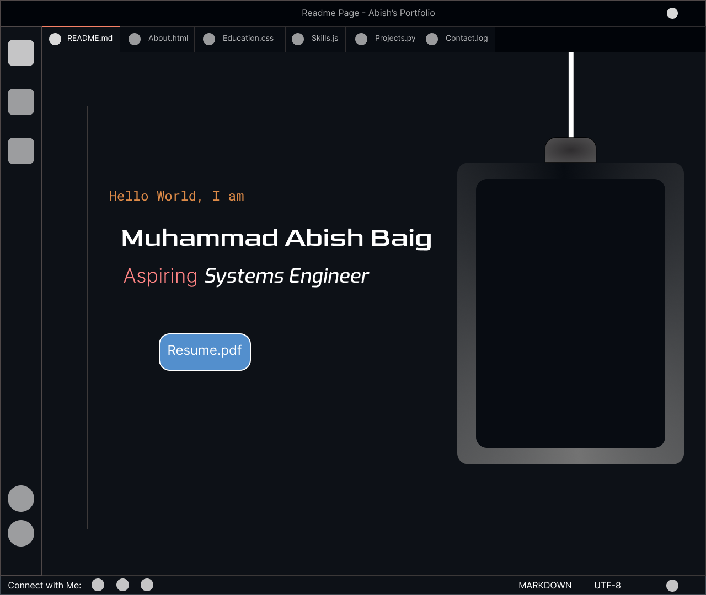

# VS-Code Inspired - Portfolio Website

A VS-Code Inspired Portfolio Website, built with Django and serves as a digital resume, showcasing my biography, education, skills, experience, and projects.



## Features

- **Dynamic Content**: Modular apps for Bio, Education, Skills, Experience, and Projects.
- **Contact Form**: A functional lead capture form (`/leads/`) that stores inquiries in the database.
- **Responsive Design**: Custom CSS styling for a professional look on all devices.
- **Admin Panel**: Manage all portfolio content easily via the Django Admin interface.

## Tech Stack

- **Backend**: Django (Python)
- **Database**: SQLite (Development)
- **Frontend**: HTML5, CSS3, JavaScript
- **Icons**: Font Awesome

## Installation

Follow these steps to set up the project locally:

1.  **Clone the Repository**
    ```bash
    git clone <repository-url>
    cd <project-folder>
    ```

2.  **Create a Virtual Environment**
    ```bash
    python -m venv .venv
    # Windows
    .venv\Scripts\activate
    # macOS/Linux
    source .venv/bin/activate
    ```

3.  **Install Dependencies**
    *(Ensure you have a `requirements.txt` or install Django manually)*
    ```bash
    pip install django python-dotenv
    # If a requirements file exists:
    # pip install -r requirements.txt
    ```

4.  **Apply Migrations**
    ```bash
    python manage.py migrate
    ```

5.  **Create a Superuser (Optional)**
    To access the admin panel:
    ```bash
    python manage.py createsuperuser
    ```

6.  **Run the Server**
    ```bash
    python manage.py runserver
    ```

    Visit `http://127.0.0.1:8000/` in your browser.

## Project Structure

- **`portfolio/`**: Main project configuration.
- **`apps/`**: Contains modular applications:
    - `bio`: Biography information.
    - `education`: Academic background.
    - `skills`: Technical and soft skills.
    - `experience`: Work history.
    - `projects`: Showcase of personal/professional projects.
    - `leads`: Contact form and handling.
- **`static/`**: CSS, JavaScript, and other static assets.
- **`templates/`**: HTML templates.

## Contributing

Contributions, issues, and feature requests are welcome!

## License

This project is open source and available under the [MIT License](LICENSE).
